# Geolocation with Real Human Gameplay Data: A Large-Scale Dataset and Human-Like Reasoning Framework

Zirui Song1, Jingpu Yang2, Yuan Huang2, Jonathan Tonglet3, Zeyu Zhang4, Tao Cheng5, Meng Fang6, Iryna Gurevych1, and Xiuying Chen1

1MBZUAI

3TU Darmstadt and KU Leuven

5University College London

2Northeastern University

4Australian National University

6University of Liverpool

# Abstract

Geolocation aims to identify an image’s location and requires complex reasoning, playing an important role in navigation, monitoring, and cultural preservation. However, existing methods often yield coarse and noninterpretable predictions. A key challenge is the limited quality and scale of current geolocation datasets, which are typically small, automatically constructed, and suffer from noise and inconsistent difficulty. To address these challenges, we introduce a comprehensive geolocation framework with three key components: GeoComp, a large-scale dataset; Geo-CoT, a novel reasoning method; and GeoEval, designed to evaluate the correctness of the geolocation reasoning process. At the core of this framework is GeoComp, a large-scale dataset collected from a geolocation game platform involving 740K users over two years. It comprises 25 million entries of metadata and 2.7 million geo-tagged locations spanning much of the globe, with each location annotated thousands to tens of thousands of times by human users. Building on this dataset, we propose Geographical Chain-of-Thought (Geo-CoT), a multi-step reasoning framework designed to enhance the reasoning capabilities of Large Vision Models (LVMs) in geolocation tasks. Finally, we demonstrate that Geo-CoT significantly boosts performance by up to $2 5 \%$ on classic geolocation metrics and by $9 \%$ in reasoning quality as measured by GeoEval:

$\ Q$ Github link.

# 1 Introduction

Geolocation, the task of determining an image’s geographical location, is crucial for applications like crime tracking, navigation, fact-checking, and cultural exploration (Cheng et al., 2022; Chalvatzaras et al., 2022). It involves interpreting contextual clues within an image, such as architectural styles, road signs, natural landscapes, and cultural markers. Inferring location from such diverse indicators

Table 1: Comparison of Existing Geolocation Datasets and GeoComp. “Local” refers to city- or region-specific data, while “Global” spans multiple continents. Darker green shades indicate broader geographic coverage.   

<table><tr><td>Dataset</td><td>Size</td><td>Geographic Coverage</td><td>Source</td><td>Open Access</td><td>Human Annotation</td></tr><tr><td>Google-WS-15k (Clark et al., 2023a)</td><td>15k</td><td>Global</td><td>Map Service</td><td>X</td><td>X</td></tr><tr><td>GMCP (Zamir and Shah, 2014)</td><td>105K</td><td>Local</td><td>Map Service</td><td>X</td><td>X</td></tr><tr><td>StreetCLIP (Haas et al., 2023)</td><td>1M</td><td>Unknown</td><td>Map Service</td><td>X</td><td>X</td></tr><tr><td>Im2GPS (Hays and Efros, 2008)</td><td>237</td><td>Local</td><td>Web-Scraped</td><td>✓</td><td>X</td></tr><tr><td>Im2GPS3K (Vo et al., 2017b)</td><td>2997</td><td>Local</td><td>Web-Scraped</td><td>✓</td><td>X</td></tr><tr><td>YFCC4K (Vo et al., 2017b)</td><td>4536</td><td>Local</td><td>Web-Scraped</td><td>✓</td><td>X</td></tr><tr><td>YFCC26K (Theiner et al., 2022a)</td><td>26k</td><td>Local</td><td>Web-Scraped</td><td>✓</td><td>X</td></tr><tr><td>MP-16 (Larson et al., 2017)</td><td>4.7M</td><td>Local</td><td>Web-Scraped</td><td>✓</td><td>X</td></tr><tr><td>OSV-5M (Astruc et al., 2024)</td><td>5.1M</td><td>Global</td><td>Map Service</td><td>✓</td><td>X</td></tr><tr><td>GeoComp</td><td>2.7M</td><td>Global</td><td>Map Service</td><td>✓</td><td>✓</td></tr></table>

demands advanced reasoning, making geolocation a challenging task for both artificial models and human experts (Khan et al., 2024).

Significant effort has been devoted to solving the geolocation task (Vo et al., 2017a; Weyand et al., 2016a; Zhu et al., 2022; Müller-Budack et al., 2018), but often at a coarse level of granularity and unlocalizability. The reason is potentially due to the lack of high-quality datasets. For example, Im2GPS3K contains up to $35 \%$ non-localizable images (Astruc et al., 2024), while the YFC100M dataset includes irrelevant data such as indoor photos and food images, which provide little to no locational information (Theiner et al., 2022a). Additionally, many datasets are limited in size, with Georeasoner (Li et al., 2024) featuring only 3K images, thereby restricting the robustness and generalizability of geolocation models. A comparison of these datasets is shown in Table 1.

To address the above obstacles, in this work, we leverage the contributions of hundreds of thousands of geolocation game enthusiasts who provide real user prediction annotations while playing the game. Specifically, we launched a free, publicbenefit-oriented online geoguessing platform in June 2022. A screenshot of the platform’s GUI is provided in Appendix A. In each game, two players independently guess the location based on the same image and their own hints, with scores

determined by the distance between their predictions and the ground-truth location. The images are sourced from Google Maps, Baidu Maps, Tencent Maps, and Gaode Maps. The platform offers multiple game modes, allowing users to either choose opponents or join random matchups. As of December 2024, this platform has 740K users, 2.7M locations as unique geolocation tasks, and 25M human response records. We name the collected dataset GeoComp. This rich and valuable dataset of real human responses enables us to evaluate task difficulty and filter out unreasonable cases. For instance, some tasks are too easy, such as when the name of a shopping mall in a city is clearly visible in the image, enabling most users to answer correctly. On the other hand, some tasks are highly challenging, where only a few users spend considerable time before providing accurate answers. Additionally, there are unreasonable tasks that contain no identifiable hints, making them unsolvable for all users despite significant effort.

Unlike previous approaches that address this task with a coarse level of granularity, we conduct a comprehensive evaluation of recent advanced LVMs on GeoComp, where the models are required to reason and predict the exact city of a given location. Our findings reveal that this task poses a significant challenge for existing LVM models. To address this, we introduce a Geographical Chain of Thought (GeoCoT) approach, which automatically guides the reasoning process through multi-step analysis of geographical cues, such as landmarks, environmental features, and spatial relationships. For the evaluation of the reasoning process, we propose a set of articulated evaluation metrics, named as GeoEval including comparison with ground truth reasoning data and intrinsic evaluation. The results demonstrate that our GeoCoT paradigm significantly improves geolocation accuracy. It not only helps break down complex tasks into manageable reasoning steps but also enhances the interpretability of the inference process.

Our work makes key contributions to geolocation. First, we present GeoComp, a large-scale, human-annotated geolocation dataset with over 2.7 million location images with corresponding location labels, and 25 million human player annotations, featuring diverse geographic regions, languages, and environmental contexts. These annotations identify different difficulty geolocation cases and establish benchmarks to guide future advancements. Second, we introduce the Geographical

Chain of Thought (GeoCoT) framework, a multistep reasoning approach that improves geolocation accuracy by leveraging geographical cues like landmarks, environmental features, and spatial relationships. Finally, through comprehensive evaluations involving human assessments and LLM inferences, we show that GeoCoT improves predictive performance by up to $25 \%$ while enhancing interpretability.

# 2 Related work

# 2.1 Image Geolocation Task

Image geolocation refers to determining the corresponding location of a given image, a crucial task in computer vision (Zhu et al., 2023b,a, 2024b), spatial data mining (Zhao et al., 2017, 2016; Zhang et al., 2023d; Han et al., 2023), and GeoAI (Zhao and Tang, 2017; Zhao et al., 2022; Zhang et al., 2023c,e). Previous research in image geolocalization could be primarily classified into two approaches: classification-based methods and retrieval-based methods. (1) Classification-based methods partition most regions of the Earth into multiple grid cells. Models are trained to classify each image into the correct cell (Clark et al., 2023b; Pramanick et al., 2022; Müller-Budack et al., 2018; Seo et al., 2018; Weyand et al., 2016b). The center coordinates of each cell are used as the predicted values. However, due to the limited number of cells, the granularity of the predicted values is coarse, preventing precise predictions. (2) Retrieval-based methods establish a database of geographic images with GPS coordinates. For a given input image, these methods retrieve the most similar image from the dataset and use its coordinates as the predicted location (Zhu et al., 2022; Müller-Budack et al., 2018; Zhang et al., 2023a; Workman et al., 2015; Liu and Li, 2019; Zhou et al., 2024). However, constructing a comprehensive global-level image database is clearly impractical.

# 2.2 Geolocation Dataset

Existing geolocation datasets primarily originate from web-scraped or street-view images that have not been human-validated, raising concerns about their quality for effectively evaluating geolocation capabilities. For instance, datasets derived from web scraping, such as YFCC100M (Theiner et al., 2022b) and Im2GPS3K (Vo et al., 2017a), include a significant proportion of images depicting food, art, pets, and personal photographs. These types

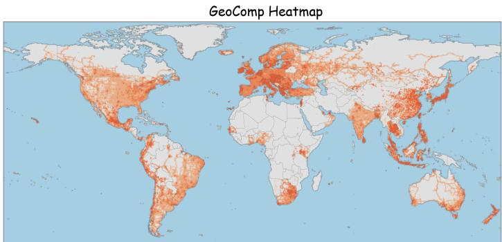

OsV-5M Heatmap

Figure 1: Comparison of data distribution between our GeoComp dataset and the existing SOTA OSV-5M dataset. (a) Global geographical heatmaps illustrating image density. (b–c) Country-level statistical breakdowns for GeoComp and OSV-5M, respectively. The Geo-Pop Index, defined as the harmonic mean of Area Bias and Population Bias, is used to comprehensively assess distribution balance. Index values are color-coded to indicate balance levels:   
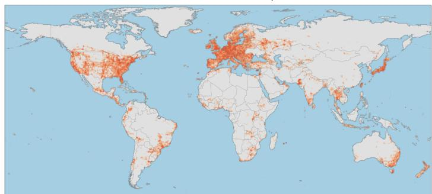  
High Balance , Moderate Balance , Imbalance , and Critical Imbalance .

<table><tr><td>103</td><td colspan="5">GeoComp Dataset</td></tr><tr><td>Country</td><td>Dataset Proportion</td><td>Area Bias</td><td>Pop. Bias</td><td>Geo-Pop Index</td><td></td></tr><tr><td>China</td><td>16.39%</td><td>2.55</td><td>0.95</td><td>1.38</td><td></td></tr><tr><td>United States</td><td>6.75%</td><td>1.10</td><td>1.62</td><td>1.31</td><td></td></tr><tr><td>Indonesia</td><td>3.72%</td><td>3.05</td><td>1.08</td><td>1.59</td><td></td></tr><tr><td>Brazil</td><td>3.82%</td><td>0.67</td><td>1.47</td><td>0.92</td><td></td></tr><tr><td>Russia</td><td>6.04%</td><td>0.55</td><td>3.41</td><td>0.95</td><td></td></tr><tr><td>India</td><td>2.11%</td><td>1.06</td><td>0.12</td><td>0.21</td><td></td></tr><tr><td>Mexico</td><td>3.30%</td><td>2.52</td><td>2.06</td><td>2.27</td><td></td></tr><tr><td>Argentina</td><td>2.18%</td><td>1.18</td><td>3.82</td><td>1.80</td><td></td></tr><tr><td>Canada</td><td>3.07%</td><td>0.46</td><td>6.14</td><td>0.86</td><td></td></tr><tr><td>Australia</td><td>3.06%</td><td>0.59</td><td>9.27</td><td>1.11</td><td></td></tr><tr><td>Global Std. Dev.</td><td>-</td><td>-</td><td>-</td><td>0.57</td><td></td></tr></table>

(b)   
（c）  

<table><tr><td colspan="5">OSV-5M Dataset</td></tr><tr><td>Country</td><td>Dataset Proportion</td><td>Area Bias</td><td>Pop. Bias</td><td>Geo-Pop Index</td></tr><tr><td>China</td><td>0.16%</td><td>0.02</td><td>0.01</td><td>0.01</td></tr><tr><td>United States</td><td>24.90%</td><td>3.95</td><td>5.93</td><td>4.74</td></tr><tr><td>Indonesia</td><td>0.75%</td><td>0.58</td><td>0.21</td><td>0.31</td></tr><tr><td>Brazil</td><td>2.87%</td><td>0.50</td><td>1.10</td><td>0.69</td></tr><tr><td>Russia</td><td>4.54%</td><td>0.41</td><td>2.67</td><td>0.71</td></tr><tr><td>India</td><td>1.03%</td><td>0.52</td><td>0.06</td><td>0.10</td></tr><tr><td>Mexico</td><td>1.09%</td><td>0.78</td><td>0.68</td><td>0.73</td></tr><tr><td>Argentina</td><td>0.85%</td><td>0.47</td><td>1.42</td><td>0.71</td></tr><tr><td>Canada</td><td>1.72%</td><td>0.27</td><td>3.44</td><td>0.50</td></tr><tr><td>Australia</td><td>3.31%</td><td>0.64</td><td>11.03</td><td>1.21</td></tr><tr><td>Global Std. Dev.</td><td>-</td><td>-</td><td>-</td><td>1.37</td></tr></table>

of images are often weakly localizable or entirely non-localizable (Theiner et al., 2022a). Street-view datasets also face limitations, such as restricted geographic coverage (Astruc et al., 2024); for example, (Mirowski et al., 2019)’s work includes data from only three cities in the United States. Furthermore, dataset collection processes often introduce biases. For instance, some commonly used platforms are inaccessible in certain countries, resulting in uneven geographic representation. Additionally, the difficulty of individual geolocation tasks varies widely within these datasets, but this aspect has not been comprehensively evaluated. For example, images taken at prominent landmarks are relatively easy to geolocate, while others offer no clear hints and are highly challenging (Astruc et al., 2024). These limitations undermine the reliability of current geolocation benchmarks.

# 2.3 Large Vision Language Models

Numerous studies have been conducted on various aspects of LVMs, encompassing structural design (Liu et al., 2024b; Cai et al., 2023; Liu et al., 2024a), data construction (LAION, 2023; Zhao et al., 2024), training strategies (Zhao et al., 2023; McKinzie et al., 2024; Lu et al., 2024), evalua-

tions (Bithel and Bedathur, 2023), and the development of lightweight LVMs (Zhu et al., 2024a). Additionally, the robust capabilities of LVMs have been applied to other fields, such as medical image understanding (Zhou and Huang, 2024; Zhang et al., 2023b, 2024) and document parsing (Ye et al., 2023; Liu et al., 2024c). However, the reasoning capabilities of LVMs in geolocation tasks remain underexplored. One of the primary reasons for this limitation is the lack of high-reasoning-value geographic data.

# 3 Data Overview

# 3.1 Geolocation Competition

Inspired by geoguessr website, we developed a free geolocation game platform that tracks participants’ competition histories. Unlike most geolocation websites, including Geoguessr, which rely solely on samples from Google Street View, our platform integrates Baidu Maps, Tencent Maps, and Gaode Maps to address coverage gaps in regions like mainland China, ensuring broader global accessibility. Users can choose specific opponents or engage in random matches. Each match consists of multiple questions, and each user is initially assigned a “vitality score.” Users mark their predicted location

on a map, and the system evaluates accuracy based on the surface distance between the predicted point and the ground truth. Larger errors result in greater deductions from the user’s vitality score. The user with the higher vitality score at the end of the match is declared the winner. To ensure predictions are human-generated rather than machine-generated, users must register with a phone number, enabling tracking of individual activities. Using this platform, we collected GeoComp, a comprehensive dataset covering 1,000 days of user competition.

# 3.2 Dataset Statistics and Geographic Balance

To comprehensively evaluate the geographical distribution quality of our dataset, we conduct a comparative analysis with the existing SOTA dataset, OSV-5M (Astruc et al., 2024). Figure 1(a) visualizes the global density of the dataset via geographical heatmaps. Compared to OSV-5M, which exhibits a skewed distribution towards Western regions, GeoComp demonstrates a significantly more comprehensive coverage. First, GeoComp successfully mitigates the data sparsity in underrepresented areas, achieving dense coverage in East Asia and South America. Second, our improved global balance does not sacrifice the density of data in well-covered areas. As evidenced by the higher heatmap intensity, our dataset maintains superior sampling density even in Western regions (e.g., Europe and North America) compared to OSV-5M. This dual advantage, expanding global reach while intensifying local density, ensures that GeoComp is both spatially balanced and densely distributed.

To further validate the distribution quality beyond visual inspection, we propose the Area Bias and Population Bias ratios, calculated as the quotient of a country’s proportion in the dataset to its respective global share of land area or population. To synthesize spatial and population factors, we define the Geo-Pop Index as the harmonic mean of Area Bias and Population Bias, where 1.0 indicates perfect parity. We categorize distribution quality into four levels based on the magnitude of deviation:High Balance (0.8–1.4) denotes optimal alignment with real-world shares; Moderate Balance (0.3–0.8 or 1.4–3.0) and Imbalance (0.1–0.3 or 3.0–4.5) reflect increasing degrees of skew; while Critical Imbalance $( < 0 . 1 \mathrm { o r } > 4 . 5 )$ ) identifies extreme outliers that are either under-represented by over $1 0 \times$ or over-sampled by more than $4 . 5 \times$ . The statistical breakdown reveals a severe polarization in OSV-5M. As shown in Figure 1(c), it exhibits

Critical Imbalance in major nations: the United States is disproportionately over-represented (accounting for $2 4 . 9 0 \%$ of the data with an Index of 4.74), while China is severely under-represented (only $0 . 1 6 \%$ , Index 0.01). In contrast, GeoComp effectively mitigates these imbalances, achieving a status of High Balance across the mainstream country (Figure 1(b)). For instance, the representation of China is restored to a reasonable $1 6 . 3 9 \%$ (Index 1.38), and the United States is normalized to $6 . 7 5 \%$ (Index 1.31), reflecting a distribution more aligned with real-world geography and population. Overall, the majority of countries in GeoComp fall within the High Balance range, demonstrating a stable distribution (Global Std. Dev. of 0.57). Conversely, OSV-5M is predominantly characterized by Moderate Balance and Critical Imbalance, resulting in a significantly higher deviation of 1.37.

# 3.3 Human Annotations

Distinct from previous works, GeoComp includes rich human gameplay data, serving as a vital benchmark for evaluating geolocation difficulty and image localizability. We analyze performance using the GeoGuessr scoring mechanism, where a user’s score $S$ decays exponentially with the distance error $d$ . The score is calculated as $S \ =$ $\lfloor \exp ( - d / s _ { d } ) \times 5 0 0 0 \rfloor$ , where $s _ { d }$ is a scale factor derived from the map’s maximum distance. A perfect prediction $\left[ d = 0 \right]$ ) yields 5,000 points. To establish a reliable difficulty benchmark, we visualized the dataset for the annotated locations and calculated the average score for each location. The resulting distribution is shown in Figure 3.

As illustrated in the histogram, the dataset exhibits a broad spectrum of difficulty levels. The 0–1,000 score range constitutes the largest portion of the data, accounting for approximately $2 7 . 6 \%$ This high concentration of low scores reveals a substantial subset of hard samples, which are typically located in remote or rural areas and lack explicit semantic cues such as text signs. For these locations, accurate localization requires fine-grained reasoning over implicit environmental features, including vegetation patterns, soil texture, and architectural styles. The poor human performance in this range suggests that average players generally lack the specialized domain knowledge needed to interpret these subtle cues, which often results in near-random guessing. This characteristic highlights the opportunity for models to surpass human performance by effectively learning high-entropy

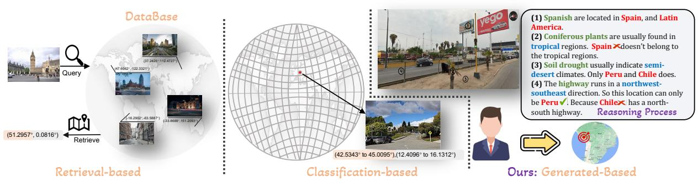

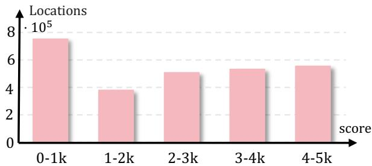  
Figure 2: Comparison of previous geolocation tasks and our proposed paradigm: while previous works focused on coarse-grained predictions limited by dataset quality, our generation and reasoning-based method enables fine-grained city-level predictions.   
Figure 3: Number of locations distributed across different average score intervals.

environmental representations. Overall, this distribution confirms that GeoComp serves as a robust benchmark, providing sufficient challenging samples to stress state-of-the-art models while retaining a substantial volume of human-solvable data to support meaningful geographic feature learning.

# 4 Geographic Chain of Thought

# 4.1 Rethinking Geolocation Task

As discussed in $\ S \ 2 . 1$ , the geolocation task has traditionally relied on classification-based (Clark et al., 2023b; Pramanick et al., 2022; Weyand et al., 2016b) and retrieval-based methods (Zhu et al., 2022; Zhang et al., 2023a), as shown in Figure 2. While these approaches have advanced the field, they face significant limitations in precision and scalability, prompting a rethinking of the task. Inspired by how humans gradually narrow down locations from broad to fine-grained observations (Luo et al., 2022), we propose a new geolocation paradigm: predicting geographic locations through a step-by-step reasoning process. Unlike traditional approaches limited by gridbased classification and exhaustive databases, our model generates natural language reasoning, guiding it to the final predicted city. To implement this paradigm, we introduce GeoCoT (Geographic

Chain-of-Thought), a framework designed for both interpretability and accuracy.

# 4.2 GeoCoT Deisgn

Our design of GeoCoT is inspired by how humans intuitively approach geolocation—progressing from broad to fine-grained analysis. Rather than relying on generic step-by-step reasoning like standard CoT prompting, GeoCoT mimics the human process: starting with macro-level cues (e.g., climate, terrain), then narrowing down to country, city, and finally micro-level details to guide the model through interpretable geographic reasoning.

Concretely, GeoCoT operates in five sequential stages: 1. Continental or Climate Zone Identification. The process begins with identifying broad regions using natural features like mountains, vegetation, or soil, narrowing the scope to a continent or climate zone. 2. Country-Level Localization. Cultural markers, language on signs, and architectural styles are analyzed to refine predictions to the country level. 3. City-Level Refinement Using Infrastructure. Street elements, such as driving direction, bollards, and license plate colors, are used to locate specific cities or regions. 4. Landmark-Based Verification. Features like fire hydrants, guideposts, and street signs help validate and further refine the predicted location. 5. Fine-Grained Micro-Level Validation. Finally, subtle details such as sidewalk patterns and clothing styles confirm precise localization at a city or neighborhood level. These five reasoning steps are formulated as a single, structured prompt and jointly fed into the LVM, which directly generates the final predicted location. Detailed prompts can be found in Appendix B.

It is important to note that GeoCoT does not require any concrete knowledge about the specific features of locations. Instead, it offers reason-

Table 2: Comparison of Precision, Recall and F1 scores in country-level and city-level geolocation. The scores are represented as follows: best , second , and third . Numbers in bold mean that the improvement to the best baseline is statistically significant (a two-tailed paired t-test with p-value ${ < } 0 . 0 5$ ).   

<table><tr><td rowspan="2">Model</td><td colspan="3">City</td><td colspan="3">Country</td><td colspan="3">Continent</td></tr><tr><td>Accuracy↑</td><td>Recall↑</td><td>F1↑</td><td>Accuracy↑</td><td>Recall↑</td><td>F1↑</td><td>Accuracy↑</td><td>Recall↑</td><td>F1↑</td></tr><tr><td>LLaVA-1.6</td><td>0.002</td><td>0.001</td><td>0.002</td><td>0.041</td><td>0.019</td><td>0.028</td><td>0.175</td><td>0.067</td><td>0.056</td></tr><tr><td>LLama-3.2-Vision</td><td>0.081</td><td>0.037</td><td>0.030</td><td>0.630</td><td>0.199</td><td>0.217</td><td>0.866</td><td>0.643</td><td>0.639</td></tr><tr><td>Qwen-VL</td><td>0.016</td><td>0.013</td><td>0.014</td><td>0.069</td><td>0.042</td><td>0.070</td><td>0.130</td><td>0.115</td><td>0.077</td></tr><tr><td>GeoCLIP</td><td>0.018</td><td>0.007</td><td>0.008</td><td>0.550</td><td>0.197</td><td>0.204</td><td>0.872</td><td>0.746</td><td>0.731</td></tr><tr><td>GeoReasoner</td><td>0.018</td><td>0.014</td><td>0.012</td><td>0.092</td><td>0.053</td><td>0.085</td><td>0.208</td><td>0.161</td><td>0.144</td></tr><tr><td>Kimi-latest</td><td>0.027</td><td>0.023</td><td>0.024</td><td>0.135</td><td>0.112</td><td>0.156</td><td>0.315</td><td>0.148</td><td>0.220</td></tr><tr><td>Kimi-latest(CoT)</td><td>0.028</td><td>0.029</td><td>0.029</td><td>0.139</td><td>0.092</td><td>0.124</td><td>0.331</td><td>0.154</td><td>0.210</td></tr><tr><td>Kimi-latest(GeoCoT)</td><td>0.038</td><td>0.035</td><td>0.029</td><td>0.239</td><td>0.192</td><td>0.224</td><td>0.361</td><td>0.168</td><td>0.232</td></tr><tr><td>GPT-4o</td><td>0.092</td><td>0.048</td><td>0.044</td><td>0.615</td><td>0.188</td><td>0.208</td><td>0.807</td><td>0.468</td><td>0.487</td></tr><tr><td>GPT-4o(CoT)</td><td>0.094</td><td>0.052</td><td>0.042</td><td>0.623</td><td>0.194</td><td>0.212</td><td>0.819</td><td>0.430</td><td>0.449</td></tr><tr><td>GeoCoT</td><td>0.118</td><td>0.089</td><td>0.086</td><td>0.640</td><td>0.260</td><td>0.291</td><td>0.862</td><td>0.638</td><td>0.646</td></tr></table>

ing tutorials designed to help LVMs identify geographic clues by leveraging their existing knowledge. Our inference time and efficiency analysis in Appendix E shows that GeoCoT incurs only about a $10 \%$ increase in inference latency compared to standard CoT. We further provide an ablation study in Appendix F.

# 5 Experiments

# 5.1 Setting

We selected 500 geo-tagged locations with high inferential value from the dataset to serve as a test set, using a stratified sampling method across continents to ensure balanced geographic distribution. This number is larger than in previous works (Liu et al., 2023b; Guan et al., 2024), which typically include only a few dozen case studies to examine the reasoning process. Specifically, we selected 20 mainstream countries across six continents as representative samples and extracted tasks with an average player score of around 3,000 out of 5,000 for annotation. This test set has been publicly released on GitHub.

# 5.2 Baselines

We compare GeoCoT against strong baselines representing recent geolocation advancements. For general open-source VLMs, we evaluate LLaVA-1.6 (Liu et al., 2023a), Llama-3.2-vision (Meta, 2024), and Qwen2.5-VL (Bai et al., 2023), also include geolocation-specific models GeoCLIP (Vivanco Cepeda et al., 2024) and GeoReasoner (Li et al., 2024). Furthermore, we assess closed-source performance using GPT-4o (OpenAI, 2024), Kimi k2 (Team et al., 2025) and also utilizing chain-ofthought reasoning (Wei et al., 2022). All models

are evaluated using the same input format and test set to ensure a fair comparison.

# 5.3 Overall Performance Evaluation of GeoCoT

We evaluate geolocation performance from two aspects: first, location prediction compared with the ground truth at various levels; and second, the direct calculation of the Earth’s surface distance. We present the location prediction performance in Table 2, evaluated across three levels: city, country, and continent. Performance is measured using accuracy, which calculates the proportion of correct predictions out of all predictions; recall, which determines the proportion of true positive predictions out of all actual positive cases; and the F1 score, which balances precision and recall to provide their harmonic mean.

The results reveal several key observations. First, open-source LVMs such as LLaMA-3.2-Vision achieve competitive performance, performing on par with GPT-4o and GPT-4o (CoT), demonstrating their effectiveness in location prediction tasks. Second, performance varies across different levels of granularity. While GPT-4o (CoT) ranks second at the city level, it underperforms at the country level, highlighting the importance of multi-level evaluation to fully assess a model’s geolocation reasoning ability. Finally, our model, GeoCoT, consistently achieves top performance across all nine metrics and three levels, demonstrating its robustness and adaptability in geolocation tasks. Additionally, GeoCLIP surpasses GPT-4o at the continent level, which can be attributed to its pretraining on image-GPS pairs, making it particularly well-suited for coarse-grained geolocation tasks. Coarse-grained continent-level predictions typically require less de-

tailed local knowledge and instead rely on broader geographic cues, such as climate, landscapes, and cultural markers. However, GeoCLIP performs poorly at finer granularities like city levels, suggesting that it lacks a strong capability for geographic reasoning beyond direct visual features.

<table><tr><td>Model</td><td>Street 1km</td><td>City 25km</td><td>Country 750km</td></tr><tr><td>LLaVA-1.6</td><td>0.006</td><td>0.020</td><td>0.082</td></tr><tr><td>Llama-3.2-Vision</td><td>0.018</td><td>0.104</td><td>0.638</td></tr><tr><td>Qwen-VL</td><td>0.004</td><td>0.014</td><td>0.090</td></tr><tr><td>GeoCLIP</td><td>0.035</td><td>0.077</td><td>0.625</td></tr><tr><td>GeoReasoner</td><td>0.010</td><td>0.020</td><td>0.128</td></tr><tr><td>GPT-4o</td><td>0.045</td><td>0.147</td><td>0.678</td></tr><tr><td>GPT-4o(CoT)</td><td>0.047</td><td>0.151</td><td>0.701</td></tr><tr><td>GeoCoT</td><td>0.073</td><td>0.157</td><td>0.711</td></tr></table>

Table 3: Accuracy of different models on geolocation tasks at various scales. Numbers in bold mean that the improvement to the best baseline is statistically significant (a two-tailed paired t-test with p-value ${ < } 0 . 0 5$ ).

Next, in Table 3, we present the accuracy of each model by measuring the geographic distance between the predicted city and the ground truth. The metrics represent the proportion of predictions within three distance thresholds: Street (1 km), City $( 2 5 \ \mathrm { k m } )$ ), and Country $( 7 5 0 ~ \mathrm { k m } )$ . Higher values indicate better performance, with stricter thresholds assessing fine-grained localization and larger thresholds evaluating coarse-level accuracy. The results show that GPT-4o and Llama-3.2-vision outperform the dedicated large-scale model Geo-CLIP for geolocation, even under finer-grained evaluation settings. For example, at the streetlevel threshold, GPT-4o achieves 0.045 compared to GeoCLIP’s 0.035, and at the city-level threshold, GPT-4o scores 0.147, nearly double GeoCLIP’s 0.077. Moreover, our proposed GeoCoT paradigm demonstrates even greater improvements. At the street level, GeoCoT achieves 0.073, significantly outperforming both GeoCLIP (0.035) and GPT-4o (0.045). Similarly, at the city level, GeoCoT achieves 0.157, and at the country level $( 7 5 0 \mathrm { k m } )$ , it achieves 0.711, the highest among all models. These results highlight GeoCoT’s strong performance and the potential of its reasoning framework for geolocation tasks. We further provide an ablation study on GeoCoT in Appendix F.

# 5.4 Generalizability Evaluation

Even though our dataset is more comprehensive and human-annotated, we are also interested in evaluating how our model performs on traditional geolocation datasets to provide a more thorough

<table><tr><td rowspan="2">Model</td><td colspan="3">Im2GPS</td><td colspan="3">Im2GPS3K</td></tr><tr><td>Street 1km</td><td>City 25km</td><td>Country 750km</td><td>Street 1km</td><td>City 25km</td><td>Country 750km</td></tr><tr><td>LLaVA-1.6</td><td>0.04</td><td>0.18</td><td>0.39</td><td>0.03</td><td>0.14</td><td>0.32</td></tr><tr><td>Llama-3.2-Vision</td><td>0.09</td><td>0.37</td><td>0.65</td><td>0.07</td><td>0.27</td><td>0.52</td></tr><tr><td>Qwen-VL</td><td>0.04</td><td>0.21</td><td>0.37</td><td>0.04</td><td>0.15</td><td>0.26</td></tr><tr><td>GeoCLIP</td><td>0.17</td><td>0.41</td><td>0.77</td><td>0.13</td><td>0.32</td><td>0.67</td></tr><tr><td>GeoReasoner</td><td>0.05</td><td>0.19</td><td>0.33</td><td>0.04</td><td>0.15</td><td>0.26</td></tr><tr><td>PlaNet</td><td>0.08</td><td>0.25</td><td>0.54</td><td>0.09</td><td>0.25</td><td>0.48</td></tr><tr><td>GPT-4o</td><td>0.13</td><td>0.47</td><td>0.74</td><td>0.14</td><td>0.40</td><td>0.66</td></tr><tr><td>GPT-4o(CoT)</td><td>0.16</td><td>0.49</td><td>0.77</td><td>0.14</td><td>0.45</td><td>0.69</td></tr><tr><td>GeoCoT</td><td>0.22</td><td>0.55</td><td>0.83</td><td>0.15</td><td>0.46</td><td>0.74</td></tr></table>

Table 4: Performance comparison of GeoCoT and stateof-the-art geolocation models on traditional benchmarks. Numbers in bold mean that the improvement to the best baseline is statistically significant (a two-tailed paired t-test with p-value ${ < } 0 . 0 5$ ).

comparison. Hence, we select two existing benchmark datasets, Im2GPS (Hays and Efros, 2008) and Im2GPS3K (Vo et al., 2017b), due to their popularity and widespread use in geolocation tasks as standard benchmarks for evaluating model performance. We present the performance results in Table 4. We observe that state-of-the-art geolocation models, such as GeoCLIP, perform well on traditional geolocation tasks, surpassing GPT-4o and coming close to our model, GeoCoT. However, this is in contrast to the results shown in Table 2, where GeoCLIP significantly underperforms GPT-4o on fine-grained city- and country-level geolocation tasks. This discrepancy suggests that these baseline models may be overfitting to the specific datasets they were trained on, lacking the generalization ability required for more diverse or fine-grained geolocation challenges.

# 5.5 GeoEval: Reference-Based Evaluation

Beyond evaluating overall task performance, we focus on analyzing the reasoning process of GeoCoT, which emulates a human-like reasoning approach. To establish a reference for this evaluation, three gaming enthusiasts collaboratively constructed reasoning processes for the same 500 cases based on geo-tagged locations. We designated these as the reasoning ground truth (a human-annotated example can be found in Appendix C). These GT annotations serve as a benchmark within our evaluation framework, GeoEval. The evaluation process utilizes GPT-based assessment through GPTScore (Fu et al., 2023) and prompt-based scoring.

Our prompt-based scoring includes four dimensions (scored 0-5; detailed prompts are on Github). First, completeness of feature extraction (CE) evaluates whether all key clues in the GT are comprehensively covered, ensuring reasoning relies on sufficient factual evidence. Second, accuracy

of feature extraction $( A E )$ measures the correctness of identified attributes to prevent reasoning deviations caused by misidentified features. Third, accuracy of reasoning and cue correspondence (AC) assesses whether conclusions derived from extracted cues are reasonable and consistent with the GT logic. Finally, logical coherence of reasoning (LC) evaluates the consistency, flow, and adherence to common sense within the reasoning chain, ensuring the reliability of the conclusion.

Table 5: Evaluation of GeoCoT’s reasoning process using ground truth-based metrics within the GeoEval framework. Numbers in bold mean that the improvement to the best baseline is statistically significant (a two-tailed paired t-test with p-value ${ < } 0 . 0 5$ ).   

<table><tr><td rowspan="2">Model</td><td rowspan="2">Similarity GPTScore</td><td rowspan="2">CE</td><td colspan="3">GeoEval</td></tr><tr><td>AE</td><td>AC</td><td>LC</td></tr><tr><td>LLaVA-1.6</td><td>0.478</td><td>1.262</td><td>1.271</td><td>1.446</td><td>1.490</td></tr><tr><td>Llama-3.2-Vision</td><td>0.566</td><td>2.203</td><td>2.386</td><td>2.558</td><td>2.721</td></tr><tr><td>Qwen-VL</td><td>0.371</td><td>1.231</td><td>1.255</td><td>1.453</td><td>1.484</td></tr><tr><td>GeoReasoner</td><td>0.424</td><td>1.421</td><td>1.533</td><td>1.719</td><td>2.038</td></tr><tr><td>GPT-4o</td><td>0.613</td><td>2.320</td><td>2.891</td><td>2.809</td><td>3.143</td></tr><tr><td>GPT-4o(CoT)</td><td>0.663</td><td>2.462</td><td>3.136</td><td>3.156</td><td>3.540</td></tr><tr><td>GeoCoT</td><td>0.728</td><td>2.690</td><td>3.538</td><td>3.696</td><td>3.945</td></tr></table>

The experimental results in Table 5 highlight the significant advantages of GeoCoT compared to baseline models across all evaluation metrics. GeoCoT achieves the highest GPTScore of 0.728, outperforming GPT-4o (CoT) (0.663) and LLaVA-1.6 (0.478), demonstrating its superior alignment with human-constructed reasoning processes. In terms of feature extraction, GeoCoT achieves a CE score of 2.690 and an AE score of 3.538, significantly surpassing GPT-4o (CoT) and the dedicated GeoReasoner model. These results clearly demonstrate that GeoCoT not only captures key information more comprehensively but also maintains a more accurate and logically coherent reasoning process compared to both reasoning-based models and traditional baselines like GeoReasoner.

# 5.6 Intrinsic Evaluation of GeoCoT Reasoning

We begin with a ground truth-based evaluation, comparing GeoCoT’s reasoning to human-authored processes to assess its alignment with established reasoning patterns. To complement this, we conduct an intrinsic evaluation focused on hallucination errors, coherence, and robustness without relying on external references. Given the need for multimodal judgment, this evaluation is performed by human annotators.

Following previous work on assessing halluci-

Table 6: Hallucination Evaluation on Reasoning Data.   

<table><tr><td>Model</td><td>OH Count↓</td><td>FH Count↓</td><td>AH Count↓</td></tr><tr><td>GeoReasoner</td><td>237</td><td>151</td><td>203</td></tr><tr><td>GPT-4o</td><td>43</td><td>4</td><td>35</td></tr><tr><td>GeoCoT</td><td>5</td><td>1</td><td>18</td></tr></table>

nations in terms of objects, attributes, and relationships (Li et al., 2023; Sun et al., 2023), we evaluate the quality of synthetic data across three key dimensions: (1) Object Hallucination (OH): assesses whether the synthetic data includes objects that do not exist in the image. Object Hallucination evaluates the extent to which synthetic data introduces fictional elements. (2) Fact Hallucination (FH) measures the accuracy of factual information within the synthetic data. Fact Hallucination occurs when the synthetic data contains facts, figures, or other information that is incorrect or not supported by the original data. (3) Attribution Hallucination (AH) evaluates whether the synthetic data incorrectly attributes properties, characteristics, or relations to entities or objects. To quantify hallucinations, each detected error is counted as one instance in the corresponding dimension. To evaluate these dimensions, we invited 2 human annotators with professional backgrounds in geographic reasoning and data validation to assess GPT-4o, Geo-Reasoner, and our proposed GeoCoT model. These three baselines provide textual reasoning processes across 1,500 evaluated cases. The results, shown in Table 6, indicate the number of errors in each dimension, demonstrating that GeoCoT significantly reduces hallucination errors compared to the other models. The inter-annotator agreement, measured by Cohen’s Kappa, is 0.82 for OH, 0.79 for FH, and 0.85 for AH, indicating substantial agreement across all dimensions. The detailed reasoning case studies are listed in Appendix D.

# 6 Conclusion

In this work, we advance the field of image geolocation by introducing GeoComp, the largest humanannotated dataset to date, comprising 2.7 million locations and 25 million real-world gameplay records. Leveraging this rich data, we propose GeoCoT, a geographical chain-of-thought framework that mimics human reasoning to enhance LVM capabilities. Comprehensive evaluations using our novel GeoEval metric demonstrate that GeoCoT significantly outperforms state-of-the-art baselines in both accuracy and interpretability.

# Limitations

Despite the advancements presented, our work has three main limitations. First, although GeoComp is globally diverse, geographic coverage remains uneven, with sparse representation in regions like Africa and parts of Oceania due to limited map service availability. Nevertheless, compared to existing large-scale geolocation benchmarks (e.g., OSV-5M), GeoComp substantially mitigates extreme regional bias and achieves a markedly more balanced global distribution, as demonstrated by the Geo-Pop Index analysis. Second, GeoCoT relies on computationally intensive LVM (e.g., GPT-4o). The multi-step reasoning process increases inference latency and cost compared to lightweight, embedding-based retrieval methods, potentially limiting real-time deployment. While this overhead is inherent to CoT-style reasoning, our empirical analysis (Appendix E) indicates that GeoCoT does not incur substantially higher latency than standard CoT prompting across different models. Finally, while GeoCoT excels at city-level localization through reasoning, it may struggle with precise meter-level coordinate prediction in non-urban environments where semantic cues (text, landmarks) are absent, an area where retrieval-based methods still hold an advantage. This limitation stems from the intrinsic reliance of reasoning-based methods on interpretable visual cues; in such low-semantic settings, direct visual matching remains more effective, and we view the integration of reasoningbased and retrieval-based paradigms as a promising direction for future work.

# Data Ethics

The creation and release of our dataset adhere to stringent ethical standards to ensure the privacy and well-being of all contributors. We have conducted rigorous anonymization of the dataset to protect user privacy. All personally identifiable information, such as usernames, email addresses, and IP addresses, has been permanently removed. Only non-identifiable behavioral data, such as prediction outcomes and timestamps, are retained. The dataset originates from user participation on our open-source geolocation game platform. Users were informed during the registration process that their activity data might be used for research purposes. This ensures transparency in data collection and maintains user trust. We have explicitly designed the dataset for research purposes, with the

sole intention of advancing geolocation and related artificial intelligence technologies. Importantly, our dataset does not include the images directly but instead provides links to images hosted on platforms such as Google Maps or Baidu Maps, which can be accessed through their official APIs. We are committed to ensuring the responsible use of this dataset. Researchers accessing the data must agree to a data usage agreement that prohibits unethical or illegal use.

# References

Guillaume Astruc, Nicolas Dufour, Ioannis Siglidis, Constantin Aronssohn, Nacim Bouia, Stephanie Fu, Romain Loiseau, Van Nguyen Nguyen, Charles Raude, Elliot Vincent, and 1 others. 2024. Openstreetview-5m: The many roads to global visual geolocation. In Proc. of CVPR, pages 21967–21977.   
Jinze Bai, Shuai Bai, Yunfei Chu, Zeyu Cui, Kai Dang, Xiaodong Deng, Yang Fan, Wenbin Ge, Yu Han, Fei Huang, and 1 others. 2023. Qwen technical report. arXiv:2309.16609.   
Shivangi Bithel and Srikanta Bedathur. 2023. Evaluating cross-modal generative models using retrieval task. In Proc. of SIGIR, pages 1960–1965.   
Rizhao Cai, Zirui Song, Dayan Guan, Zhenhao Chen, Xing Luo, Chenyu Yi, and Alex Kot. 2023. Benchlmm: Benchmarking cross-style visual capability of large multimodal models. arXiv preprint arXiv:2312.02896.   
Athanasios Chalvatzaras, Ioannis Pratikakis, and Angelos A Amanatiadis. 2022. A Survey on Map-Based Localization Techniques for Autonomous Vehicles. IEEE Transactions on Intelligent Vehicles, pages 1574–1596.   
Wenqing Cheng, Ruxue Wen, Haojun Huang, Wang Miao, and Chen Wang. 2022. OPTDP: Towards optimal personalized trajectory differential privacy for trajectory data publishing. Neurocomputing, pages 201–211.   
Brandon Clark, Alec Kerrigan, Parth Parag Kulkarni, Vicente Vivanco Cepeda, and Mubarak Shah. 2023a. Where we are and what we’re looking at: Query based worldwide image geo-localization using hierarchies and scenes. In Proc. of CVPR, pages 23182– 23190.   
Brandon Clark, Alec Kerrigan, Parth Parag Kulkarni, Vicente Vivanco Cepeda, and Mubarak Shah. 2023b. Where We Are and What We’re Looking At: Query Based Worldwide Image Geo-Localization Using Hierarchies and Scenes. In CVPR, pages 23182–23190.   
Jinlan Fu, See-Kiong Ng, Zhengbao Jiang, and Pengfei Liu. 2023. Gptscore: Evaluate as you desire. arXiv preprint arXiv:2302.04166.

Tianrui Guan, Fuxiao Liu, Xiyang Wu, Ruiqi Xian, Zongxia Li, Xiaoyu Liu, Xijun Wang, Lichang Chen, Furong Huang, Yaser Yacoob, and 1 others. 2024. Hallusionbench: an advanced diagnostic suite for entangled language hallucination and visual illusion in large vision-language models. In Proceedings of the IEEE/CVF Conference on Computer Vision and Pattern Recognition, pages 14375–14385.   
Lukas Haas, Silas Alberti, and Michal Skreta. 2023. Learning generalized zero-shot learners for opendomain image geolocalization. arXiv preprint arXiv:2302.00275.   
Xiao Han, Xiangyu Zhao, Liang Zhang, and Wanyu Wang. 2023. Mitigating action hysteresis in traffic signal control with traffic predictive reinforcement learning. In Proc. of KDD, pages 673–684.   
James Hays and Alexei A Efros. 2008. IM2GPS: estimating geographic information from a single image. In CVPR, pages 1–8.   
Sohail Ahmed Khan, Laurence Dierickx, Jan-Gunnar Furuly, Henrik Brattli Vold, Rano Tahseen, Carl-Gustav Linden, and Duc-Tien Dang-Nguyen. 2024. Debunking war information disorder: A case study in assessing the use of multimedia verification tools. Journal of the Association for Information Science and Technology.   
LAION. 2023. Gpt-4v dataset.   
Martha Larson, Mohammad Soleymani, Guillaume Gravier, Bogdan Ionescu, and Gareth JF Jones. 2017. The benchmarking initiative for multimedia evaluation: Mediaeval 2016. IEEE MultiMedia, pages 93–96.   
Ling Li, Yu Ye, Bingchuan Jiang, and Wei Zeng. 2024. Georeasoner: Geo-localization with reasoning in street views using a large vision-language model. In Proc. of ICML.   
Ling Li, Yao Zhou, Yuxuan Liang, Fugee Tsung, and Jiaheng Wei. 2025. Recognition through reasoning: Reinforcing image geo-localization with large visionlanguage models. Preprint, arXiv:2506.14674.   
Yifan Li, Yifan Du, Kun Zhou, Jinpeng Wang, Wayne Xin Zhao, and Ji-Rong Wen. 2023. Evaluating object hallucination in large vision-language models. arXiv preprint arXiv:2305.10355.   
Dongyang Liu, Renrui Zhang, Longtian Qiu, Siyuan Huang, Weifeng Lin, Shitian Zhao, Shijie Geng, Ziyi Lin, Peng Jin, Kaipeng Zhang, and 1 others. 2024a. Sphinx-x: Scaling data and parameters for a family of multi-modal large language models. arXiv preprint arXiv:2402.05935.   
Haotian Liu, Chunyuan Li, Yuheng Li, and Yong Jae Lee. 2023a. Improved baselines with visual instruction tuning.

Haotian Liu, Chunyuan Li, Qingyang Wu, and Yong Jae Lee. 2023b. Visual instruction tuning. Advances in neural information processing systems, 36:34892– 34916.   
Haotian Liu, Chunyuan Li, Qingyang Wu, and Yong Jae Lee. 2024b. Visual instruction tuning. Proc. of NeurIPS.   
Liu Liu and Hongdong Li. 2019. Lending orientation to neural networks for cross-view geo-localization. In Proc. of CVPR, pages 5624–5633.   
Yuliang Liu, Biao Yang, Qiang Liu, Zhang Li, Zhiyin Ma, Shuo Zhang, and Xiang Bai. 2024c. Textmonkey: An ocr-free large multimodal model for understanding document. arXiv:2403.04473.   
Haoyu Lu, Wen Liu, Bo Zhang, Bingxuan Wang, Kai Dong, Bo Liu, Jingxiang Sun, Tongzheng Ren, Zhuoshu Li, Yaofeng Sun, and 1 others. 2024. Deepseekvl: towards real-world vision-language understanding. arXiv preprint arXiv:2403.05525.   
Grace Luo, Giscard Biamby, Trevor Darrell, Daniel Fried, and Anna Rohrbach. 2022. G3: Geolocation via guidebook grounding. In Proc. of EMNLP Findings, pages 5841–5853.   
Brandon McKinzie, Zhe Gan, Jean-Philippe Fauconnier, Sam Dodge, Bowen Zhang, Philipp Dufter, Dhruti Shah, Xianzhi Du, Futang Peng, Floris Weers, and 1 others. 2024. Mm1: Methods, analysis & insights from multimodal llm pre-training. arXiv:2403.09611.   
AI Meta. 2024. Llama 3.2: Revolutionizing edge ai and vision with open, customizable models. Meta AI Blog. Retrieved December, page 2024.   
Piotr Mirowski, Andras Banki-Horvath, Keith Anderson, Denis Teplyashin, Karl Moritz Hermann, Mateusz Malinowski, Matthew Koichi Grimes, Karen Simonyan, Koray Kavukcuoglu, Andrew Zisserman, and 1 others. 2019. The StreetLearn environment and dataset. arXiv preprint arXiv:1903.01292.   
Eric Müller-Budack, Kader Pustu-Iren, and Ralph Ewerth. 2018. Geolocation Estimation of Photos using a Hierarchical Model and Scene Classification. In Proc. of ECCV, pages 563–579.   
OpenAI. 2024. Gpt-4o system card. arXiv preprint arXiv:2410.21276.   
Shraman Pramanick, Ewa M Nowara, Joshua Gleason, Carlos D Castillo, and Rama Chellappa. 2022. Where in the World is this Image? Transformer-based Geo-localization in the Wild. In Proc. of ECCV, pages 196–215.   
Paul Hongsuck Seo, Tobias Weyand, Jack Sim, and Bohyung Han. 2018. CPlaNet: Enhancing Image Geolocalization by Combinatorial Partitioning of Maps. In Proc. of ECCV, pages 536–551.

Zhiqing Sun, Sheng Shen, Shengcao Cao, Haotian Liu, Chunyuan Li, Yikang Shen, Chuang Gan, Liang-Yan Gui, Yu-Xiong Wang, Yiming Yang, and 1 others. 2023. Aligning large multimodal models with factually augmented rlhf. arXiv:2309.14525.   
Kimi Team, Yifan Bai, Yiping Bao, Guanduo Chen, Jiahao Chen, Ningxin Chen, Ruijue Chen, Yanru Chen, Yuankun Chen, Yutian Chen, and 1 others. 2025. Kimi k2: Open agentic intelligence. arXiv preprint arXiv:2507.20534.   
Jonas Theiner, Eric Müller-Budack, and Ralph Ewerth. 2022a. Interpretable semantic photo geolocation. In WACV.   
Jonas Theiner, Eric Müller-Budack, and Ralph Ewerth. 2022b. Interpretable Semantic Photo Geolocation. In Proceedings of the IEEE/CVF Winter Conference on Applications of Computer Vision, pages 750–760.   
Vicente Vivanco Cepeda, Gaurav Kumar Nayak, and Mubarak Shah. 2024. Geoclip: Clip-inspired alignment between locations and images for effective worldwide geo-localization. Proc. of NeurIPS.   
Nam Vo, Nathan Jacobs, and James Hays. 2017a. Revisiting im2gps in the deep learning era. In Proc. of ICCV, pages 2621–2630.   
Nam Vo, Nathan Jacobs, and James Hays. 2017b. Revisiting IMG2GPS in the deep learning era. In ICCV.   
Jason Wei, Xuezhi Wang, Dale Schuurmans, Maarten Bosma, Fei Xia, Ed Chi, Quoc V Le, Denny Zhou, and 1 others. 2022. Chain-of-thought prompting elicits reasoning in large language models. Proc. of NeurIPS, pages 24824–24837.   
Tobias Weyand, Ilya Kostrikov, and James Philbin. 2016a. PlaNet - Photo Geolocation with Convolutional Neural Networks, page 37–55.   
Tobias Weyand, Ilya Kostrikov, and James Philbin. 2016b. PlaNet - Photo Geolocation with Convolutional Neural Networks. In Proc. of ECCV, pages 37–55.   
Scott Workman, Richard Souvenir, and Nathan Jacobs. 2015. Wide-area image geolocalization with aerial reference imagery. In Proc. of ICCV, pages 3961– 3969.   
Jiabo Ye, Anwen Hu, Haiyang Xu, Qinghao Ye, Ming Yan, Yuhao Dan, Chenlin Zhao, Guohai Xu, Chenliang Li, Junfeng Tian, and 1 others. 2023. mplug-docowl: Modularized multimodal large language model for document understanding. arXiv:2307.02499.   
Amir Roshan Zamir and Mubarak Shah. 2014. Image geo-localization based on multiplenearest neighbor feature matching usinggeneralized graphs. IEEE transactions on pattern analysis and machine intelligence, pages 1546–1558.

Peng-Fei Zhang, Zi Huang, and Guangdong Bai. 2024. Universal adversarial perturbations for visionlanguage pre-trained models. In Proc. of SIGIR, pages 862–871.   
Xiaohan Zhang, Xingyu Li, Waqas Sultani, Yi Zhou, and Safwan Wshah. 2023a. Cross-View Geo-Localization via Learning Disentangled Geometric Layout Correspondence. In Proc. of AAAI, pages 3480–3488.   
Xiaoman Zhang, Chaoyi Wu, Ziheng Zhao, Weixiong Lin, Ya Zhang, Yanfeng Wang, and Weidi Xie. 2023b. Pmc-vqa: Visual instruction tuning for medical visual question answering. arXiv:2305.10415.   
Zijian Zhang, Ze Huang, Zhiwei Hu, Xiangyu Zhao, Wanyu Wang, Zitao Liu, Junbo Zhang, S Joe Qin, and Hongwei Zhao. 2023c. Mlpst: Mlp is all you need for spatio-temporal prediction. In Proc. of CIKM, pages 3381–3390.   
Zijian Zhang, Xiangyu Zhao, Qidong Liu, Chunxu Zhang, Qian Ma, Wanyu Wang, Hongwei Zhao, Yiqi Wang, and Zitao Liu. 2023d. Promptst: Promptenhanced spatio-temporal multi-attribute prediction. In Proc. of CIKM, pages 3195–3205.   
Zijian Zhang, Xiangyu Zhao, Hao Miao, Chunxu Zhang, Hongwei Zhao, and Junbo Zhang. 2023e. Autostl: Automated spatio-temporal multi-task learning. In Proc. of AAAI, pages 4902–4910.   
Han Zhao, Min Zhang, Wei Zhao, Pengxiang Ding, Siteng Huang, and Donglin Wang. 2024. Cobra: Extending mamba to multi-modal large language model for efficient inference. arXiv preprint arXiv:2403.14520.   
Xiangyu Zhao, Wenqi Fan, Hui Liu, and Jiliang Tang. 2022. Multi-type urban crime prediction. In Proc. of AAAI, pages 4388–4396.   
Xiangyu Zhao and Jiliang Tang. 2017. Modeling temporal-spatial correlations for crime prediction. In Proceedings of the 2017 ACM on Conference on Information and Knowledge Management, pages 497– 506.   
Xiangyu Zhao, Tong Xu, Yanjie Fu, Enhong Chen, and Hao Guo. 2017. Incorporating spatio-temporal smoothness for air quality inference. In Proc. of ICDM, pages 1177–1182.   
Xiangyu Zhao, Tong Xu, Qi Liu, and Hao Guo. 2016. Exploring the choice under conflict for social event participation. In Proc. of DASFAA, pages 396–411.   
Zijia Zhao, Longteng Guo, Xingjian He, Shuai Shao, Zehuan Yuan, and Jing Liu. 2023. Mamo: Finegrained vision-language representations learning with masked multimodal modeling. In Proc. of SI-GIR, pages 1528–1538.   
Baichuan Zhou and Lei Huang. 2024. Tinyllava.

Zhongliang Zhou, Jielu Zhang, Zihan Guan, Mengxuan Hu, Ni Lao, Lan Mu, Sheng Li, and Gengchen Mai. 2024. Img2loc: Revisiting image geolocalization using multi-modality foundation models and imagebased retrieval-augmented generation. In Proc. of SIGIR, page 2749–2754.   
Minjie Zhu, Yichen Zhu, Xin Liu, Ning Liu, Zhiyuan Xu, Chaomin Shen, Yaxin Peng, Zhicai Ou, Feifei Feng, and Jian Tang. 2024a. A comprehensive overhaul of multimodal assistant with small language models. arXiv preprint arXiv:2403.06199.   
Sijie Zhu, Mubarak Shah, and Chen Chen. 2022. Trans-Geo: Transformer Is All You Need for Cross-view Image Geo-localization. In CVPR, pages 1162–1171.   
Yuanshao Zhu, Yongchao Ye, Ying Wu, Xiangyu Zhao, and James Yu. 2023a. Synmob: Creating highfidelity synthetic gps trajectory dataset for urban mobility analysis. Proc. of NeurIPS, pages 22961– 22977.   
Yuanshao Zhu, Yongchao Ye, Shiyao Zhang, Xiangyu Zhao, and James Yu. 2023b. Difftraj: Generating gps trajectory with diffusion probabilistic model. Proc. of NeurIPS, pages 65168–65188.   
Yuanshao Zhu, James Jianqiao Yu, Xiangyu Zhao, Qidong Liu, Yongchao Ye, Wei Chen, Zijian Zhang, Xuetao Wei, and Yuxuan Liang. 2024b. Controltraj: Controllable trajectory generation with topologyconstrained diffusion model. In Proc. of KDD, pages 4676–4687.

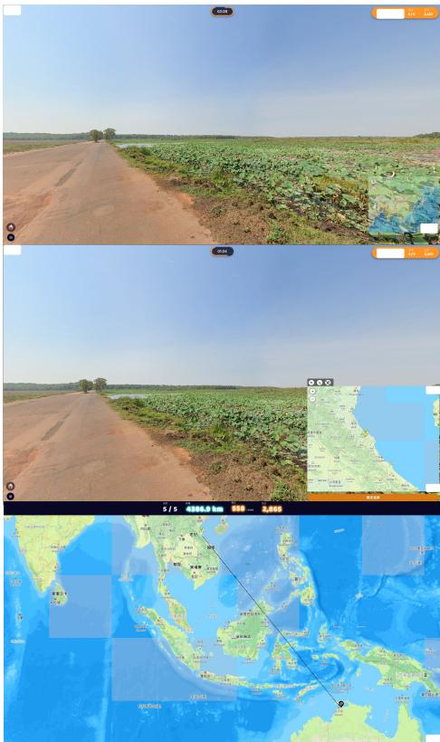  
Figure 4: UI of Gameplay. UI components that could potentially compromise the double-blind review policy were masked.

# A Data Collection Platform User Interface

To comply with the double-blind review policy, we did not include the URL of our active website in the paper. Instead, we presented selected interface screenshots of the website in Figure 4 while obscuring any elements that could potentially compromise the anonymity required by the policy.

# B Detail of GeoCoT

We present the detailed prompt of our GeoCoT process below:

• Question1: Are there prominent natural features, such as specific types of vegetation, landforms (e.g., mountains, hills, plains), or soil characteristics, that provide clues about the geographicalregion? • Question2: Are there any culturally, historically, or architecturally significant landmarks, buildings, or structures, or are there any inscriptions or signs in a specific language or script that could help determine the country or region?   
• Question3: Are there distinctive road-related features, such as traffic direction (e.g., left-hand or right-hand driving), specific types of bollards,

unique utility pole designs, or license platecolors and styles, which countries are known to have these characteristics? • Question4: Are there observable urban or rural markers (e.g., street signs, fire hydrants guideposts) , or other infrastructure elements, that can provide more specific information about the country or city? • Question5: Are there identifiable patterns in sidewalks (e.g., tile shapes, colors, or arrangements), clothing styles worn by people, or other culturally specific details that can help narrow down the city or area?

Let’s think step by step. Based on the question I provided, locate the location of the picture as accurately as possible. Identify the continent, country, and city, and summarize it into a paragraph. For example: the presence of tropical rainforests, palm trees, and red soil indicates a tropical climate... Signs in Thai, right-side traffic, and traditional Thai architecture further suggest it is in Thailand... Combining these clues, this image was likely taken in a city in Bangkok, Thailand, Asia.

Here, cyan highlights potential clues within the image to help the model infer geographic locations. Green defines the geographic scope inferred from the clues, such as a region, country, or city. Orange provides detailed descriptions of the cyan clues, enhancing the model’s understanding. Red specifies the expected output format, including city, country, and continent.

# C Human Annotation Example

Below we show an example of human annotated ground truth to demonstrate the annotation process, criteria, and the reasoning behind the annotations, where clues are shown in blue, correct predictions in green.

The image shows a rural residential area with dense trees and expansive green lawns. The terrain is flat, and the soil is reddish-brown, which matches the temperate climate of central Europe, particularly rural areas of France. The architectural style of the house is distinctive: a red-tiled sloped roof, yellow walls, and solar panels, reflecting the region’s focus on renewable energy, a common feature in French countryside homes. The red mailbox at the gate is a hallmark of rural French residences. The design of the fences and modern gates aligns with typical styles in the French countryside. The house design and surrounding natural environment suggest a rural European region. Based on the architectural style, natural landscape, and street el-

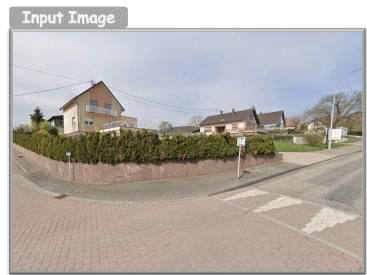  
Niederbronn-les-Bains, France, Europe

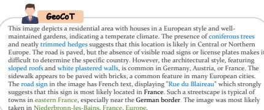

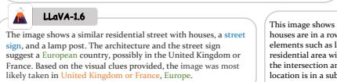

# GPT-4o

The	image	appears	to	be	from	a	residential	area	in	Europe, specifically	in	Germany.	The	architectural	style	and	surrounding vegetation	suggest	a	suburban	setting	typical	of	Western European	countries.	Given	the	style	of	the	houses	and	the	layout of	the	street,	it	is	likely	situated	in	a	smaller	city	or	town	rather than	a	major	urban	center.	This	type	of	environment	can	be found	in	various	regions	of	Germany,	which	is	known	for	its	neat and	picturesque	suburban	areas,	the	image	was	most	likely	taken in	Germany,	Europe.

# GeoReasoner

a	street	with	houses	on	both	sides	and	a	stop	sign at	an	intersection.	The w	and	there	is	a	tree	in	the	middle	of	the	street.	Based	on	the	geographic landmarks,	architecture,	language,	it	can	be	determined	that	the	location	is	a ith	a	street	and	houses	on	both	sides	of	the	road.	The	presence	of	stop	signs	at nd	the	row	of	houses	with	trees	in	the	middle	of	the	street	suggest	that	this burban	or	residential	area.	Therefore,	the	location	is	a	residential	area	with houses	on	both	sides	of	the	road. Location:Unknow

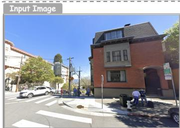  
San Francisco, USA, North America

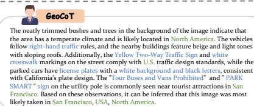

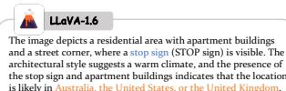

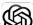

# GPT-4o

The	image's	steep	streets	and	the	body	of	water	in	the	background align	with	Seattle's geographical	features.	The	building	on	the	right	is constructed	with	red	brick	and	gray	concrete,	and	its	window	design and	roof	shape	match	the	architectural	style	of	century-old	buildings in	the	United	States.	The	prevalence	of	SUVs	in	the	image	also	aligns with	the	vehicle	preferences	of	American residents.	Therefore, considering	factors	such	as	terrain,	architectural	style,	traffic	signs, and	the	distant	body	of	water,	this	image	was	most	likely	taken	in Seattle,	USA,	North	America.

  
Figure 5: Qualitative comparison of LLaVA, GPT4o, and GeoReasoner. Clues are shown in blue, correct predictions in green, incorrect in red, and vague/uncertain guesses in orange.

# GeoReasoner

The	image	shows	a	typical	street	corner	scene	in	a	residential	area.	In	the	picture,	you	can clearly	see	an	intersection	marked	with	a	stop	sign,	several	cars	parked	along	the	roadside, and	many	pedestrians	crossing	the	street.	The	entire	scene	appears	both	busy	and	full	of	life, with	vehicles	and	pedestrians	interweaving,	demonstrating	the	area's	strong	flow	of	people and	vibrancy.	The	background	features	typical	architectural	styles	that	highlight	the residential	atmosphere,	and	all	the	details	together	form	an	orderly	yet	charming	street cormer scene

Location:	Unknow

ements, the image was most likely taken in Aumont, France, Europe.

# D Case Study

Figure 5 presents qualitative comparisons. In the first case, GeoCoT correctly identifies the location in France by integrating architectural and environmental clues, whereas baselines struggle with specific regional markers. In the second case, GeoCoT leverages text and traffic signs for precise city-level localization, while baselines like LLaVA and GPT-4o fail to capture fine-grained details.

# E Inference Time and Efficiency Analysis

To address concerns regarding computational overhead, we conducted a comprehensive performance analysis on our test set. It is important to note that a key advantage of our GeoCoT framework is its efficiency in deployment: it does not require any additional model training or fine-tuning. Instead, our contribution focuses on engineering a structured chain-of-thought prompt that elicits advanced reasoning capabilities from off-the-shelf Large Vision Models. Furthermore, we benchmark our framework against GLOBE (Li et al., 2025), a recent reasoning-driven approach that reinforces image geo-localization through policy optimization and enhanced visual-cue reasoning. Table 7 presents the average number of tokens generated and the corresponding inference time for the base model (GPT-4o), a standard Chain-of-Thought (CoT) ap-

proach, and our proposed GeoCoT framework.

Table 7: Comparison of inference time and token generation across different methods. GeoCoT introduces only a marginal increase in latency compared to standard CoT.   

<table><tr><td>Model</td><td>Avg. Generated Tokens</td><td>Avg. Inference Time (s)</td></tr><tr><td>GLOBE</td><td>397.74</td><td>8.13</td></tr><tr><td>GPT-4o</td><td>89.76</td><td>5.62</td></tr><tr><td>GPT-4o (Standard CoT)</td><td>141.58</td><td>7.57</td></tr><tr><td>GeoCoT (Ours)</td><td>173.28</td><td>8.88</td></tr></table>

The results indicate that GeoCoT introduces a modest and acceptable latency overhead, with approximately 1.3 seconds over standard CoT and 3.2 seconds over the base model. This marginal increase in response time is a direct trade-off for the more comprehensive, multi-step reasoning process required for precise geolocation. Given the significant gains in localization accuracy demonstrated in the main experiments, we consider this computational cost to be acceptable for practical applications.

# F Ablation Study on Reasoning Steps

To assess the contribution of each reasoning stage within our framework, we conducted an ablation study on the reasoning steps. The detailed results are presented in Table 8.

The experimental results indicate that single-step reasoning (e.g., relying solely on climate or infrastructure) fails to fully leverage the advantages of GeoCoT. This limitation is highlighted by the

Table 8: Ablation study on the cumulative effect of different reasoning steps within the GeoCoT framework. The results demonstrate that the combination of all five steps yields the best performance.   

<table><tr><td rowspan="2">Configuration</td><td colspan="3">City</td><td colspan="3">Country</td><td colspan="3">Continent</td></tr><tr><td>Accuracy</td><td>Recall</td><td>F1</td><td>Accuracy</td><td>Recall</td><td>F1</td><td>Accuracy</td><td>Recall</td><td>F1</td></tr><tr><td>Step1</td><td>0.113</td><td>0.098</td><td>0.076</td><td>0.551</td><td>0.133</td><td>0.151</td><td>0.776</td><td>0.443</td><td>0.468</td></tr><tr><td>Step2</td><td>0.103</td><td>0.086</td><td>0.074</td><td>0.510</td><td>0.157</td><td>0.181</td><td>0.755</td><td>0.438</td><td>0.464</td></tr><tr><td>Step3</td><td>0.102</td><td>0.073</td><td>0.076</td><td>0.490</td><td>0.142</td><td>0.165</td><td>0.673</td><td>0.334</td><td>0.380</td></tr><tr><td>Step4</td><td>0.082</td><td>0.078</td><td>0.069</td><td>0.469</td><td>0.122</td><td>0.142</td><td>0.735</td><td>0.346</td><td>0.369</td></tr><tr><td>Step5</td><td>0.102</td><td>0.088</td><td>0.078</td><td>0.551</td><td>0.151</td><td>0.173</td><td>0.776</td><td>0.338</td><td>0.363</td></tr><tr><td>Step1+2</td><td>0.112</td><td>0.083</td><td>0.086</td><td>0.571</td><td>0.196</td><td>0.190</td><td>0.795</td><td>0.443</td><td>0.468</td></tr><tr><td>Step1+2+3</td><td>0.114</td><td>0.102</td><td>0.089</td><td>0.592</td><td>0.216</td><td>0.192</td><td>0.816</td><td>0.453</td><td>0.474</td></tr><tr><td>Step1+2+3+4</td><td>0.112</td><td>0.089</td><td>0.078</td><td>0.604</td><td>0.231</td><td>0.293</td><td>0.824</td><td>0.550</td><td>0.572</td></tr><tr><td>Step1+2+3+4+5 (GeoCoT)</td><td>0.118</td><td>0.089</td><td>0.086</td><td>0.640</td><td>0.260</td><td>0.291</td><td>0.862</td><td>0.638</td><td>0.646</td></tr></table>

marginal improvements observed across all three evaluation metrics (City, Country, and Continent). As shown in the table, the performance steadily improves as more reasoning steps are integrated. Consequently, the full efficacy of our GeoCoT framework is only realized through the synergistic integration of multi-step reasoning (Step 1 through Step 5), which achieves the highest accuracy and F1 scores across all granularities.